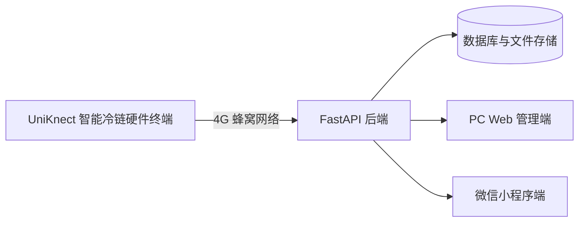

# 生物样本冷链转运交接与可信追溯系统

## 项目简介

本项目基于 UniKnect Kit GEN-1 Pro，面向高校实验室、医院检验科、科研机构等生物样本短途冷链转运场景。

系统通过温湿度、光敏、三轴加速度等传感器采集运输数据，借助 4G 蜂窝网络上传到云端，实现冷链监测、电子交接、异常告警和全过程追溯。

## 项目核心目标

- 实现生物样本转运环境实时监测
- 实现箱体开闭和运输碰撞检测
- 实现脱离 Wi-Fi 的 4G 数据上传
- 实现发出、运输、签收的电子交接
- 实现异常事件记录和责任追溯
- 自动生成任务追溯报告

## 系统组成

- UniKnect 智能冷链硬件终端
- FastAPI 后端服务
- PC Web 管理端
- 微信小程序端
- 数据库与文件存储

## 当前已完成功能

- 温湿度采集
- 光敏开箱检测
- 三轴加速度运动检测
- STABLE、MILD、SEVERE、IMPACT 状态识别
- LCD 本地显示
- SIM 卡和 4G 网络连接
- HTTP 数据上传
- FastAPI 数据接收
- SQLite 数据存储
- Web 基础看板
- 发出交接
- 到达签收
- 异常事件记录
- 基础追溯报告

## 计划开发功能

- 用户登录和角色权限
- 组织机构管理
- 生物样本管理
- 完整转运任务管理
- 设备管理
- 异常告警处理闭环
- PC Web 管理后台
- 微信小程序现场操作端
- 二维码绑定
- 电子签名和图片上传
- MySQL 数据库
- GNSS 轨迹
- 断网缓存和断点续传

## 技术栈

### 硬件终端

- UniKnect Kit GEN-1 Pro
- STM32F413
- MicroPython
- EC200U 4G 模组
- AHT20
- LIS2DH12
- 光敏传感器
- ST7735 LCD

### 后端

- Python
- FastAPI
- SQLite（当前开发）
- Python `sqlite3`（当前数据访问）
- SQLAlchemy（后续数据层升级）
- MySQL（后续正式版本）
- Uvicorn
- Pytest

### PC Web（规划）

- Vue 3
- TypeScript
- Vite
- Element Plus
- Pinia
- Axios
- ECharts

### 微信小程序（规划）

- uni-app
- Vue 3
- TypeScript
- Pinia
- `uni.request`

## 系统架构



## 项目目录说明

当前仓库中的真实目录如下：

```text
.
├── backend/        # FastAPI 后端、测试和后端运行说明
├── 开发板/         # UniKnect MicroPython 采集、显示、联网及上传程序
├── docs/           # 项目与团队协作文档
├── .gitignore
└── README.md
```

随着平台开发推进，计划逐步形成以下目录（当前尚未全部创建）：

```text
backend/
device/             # 当前对应“开发板”目录，后续是否更名由团队统一决定
web-admin/
miniprogram/
docs/
```

## 团队分工与分支

| 成员 | 主要分工 | 分支 |
| --- | --- | --- |
| zy | 项目总负责人、后端、数据库、统一管理和软硬件联调 | `zy` |
| ljy | PC Web 管理端 | `ljy` |
| zrq | 微信小程序基础框架、任务和发出交接 | `zrq` |
| tkx | 微信小程序监控、告警、签收和追溯 | `tkx` |

- `main`：稳定、可演示版本
- `zy`：后端和项目管理
- `ljy`：PC Web 管理端
- `zrq`：微信小程序任务与交接
- `tkx`：微信小程序监控与签收

详细协作流程见 [`docs/GIT_WORKFLOW.md`](docs/GIT_WORKFLOW.md)。

## 开发原则

- 先完成 MVP，再拓展功能
- 不直接把未完成代码提交到 `main`
- 每天完成任务后提交到个人分支
- 提交信息必须明确说明修改内容
- 合并前必须在负责人电脑上运行验证
- 不提交密码、Token、数据库和虚拟环境

## 项目状态

当前阶段：硬件原型和基础软硬件闭环已完成，正在进行完整软件平台开发。

## 免责声明

本项目当前为竞赛原型和教学科研用途，不存储真实患者隐私数据，不用于直接医疗诊断。
